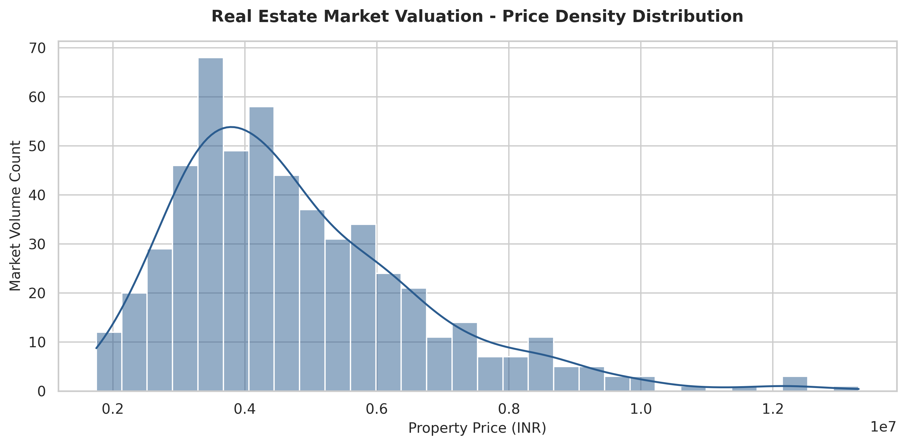
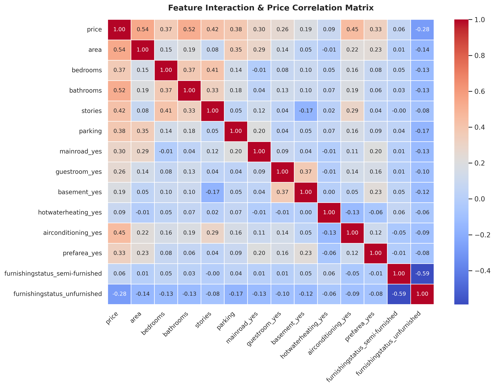
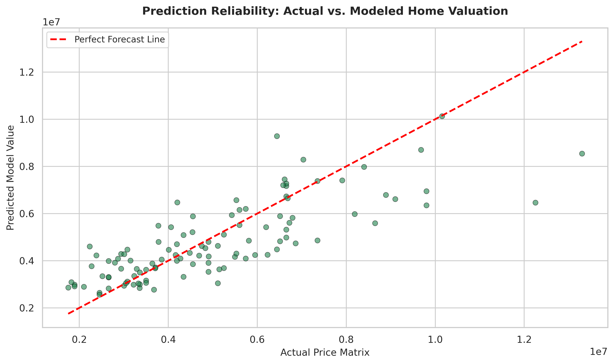

# 🏡 Real Estate Market Valuation via Advanced Regression Architectures

---

## 📌 Project Overview
This repository contains an end-to-end Machine Learning pipeline engineered to predict house prices using a structured housing dataset. The project demonstrates real-world data science workflows including deep data auditing, categorical data transformation, feature standardization, and a performance bake-off between parametric and ensemble architectures.

---

## 🛠️ Tech Stack & Core Libraries
<p align="left">
  
  
  
  
  
</p>

---

## 📊 Pipeline Architecture & Workflow

### 1️⃣ Data Exploration & Preprocessing
* **Dataset Volumetrics:** Processed 545 historical property records mapped across 13 native categorical and numerical variables.
* **Feature Engineering:** Integrated Robust One-Hot Encoding to safely translate string categoricals (`mainroad`, `airconditioning`, `furnishingstatus`) into numerical feature flags.
* **Feature Scaling:** Applied mathematical $Z$-score standardization (`StandardScaler`) to smooth optimization descent curves and eliminate variable scale bias.

### 2️⃣ Model Evaluation Framework
The dataset was isolated using a strict 80/20 train-test split. We benchmarked an Ordinary Least Squares (OLS) **Linear Regression Baseline** against a non-linear **Tuned Random Forest Regressor**:

| Evaluation Metric | Linear Regression Baseline | Tuned Random Forest Regressor |
| :--- | :---: | :---: |
| **Mean Absolute Error (MAE)** | **₹9,70,043.40** | ₹10,19,373.72 |
| **Root Mean Squared Error (RMSE)** | **₹13,24,506.96** | ₹14,03,691.56 |
| **$R^2$ Score (Variance Capture)** | **0.6529 (65.29%)** | 0.6102 (61.02%) |

---

## 📈 Analytical Inferences & Key Visualizations

### 📉 1. Price Density Distribution
Our distribution audit reveals a right-skewed market valuation model. The vast majority of standard housing stock concentrates tightly within the ₹3.5M to ₹5.0M price spectrum, trailing off gracefully into long-tail premium real estate options.



### 🌡️ 2. Feature Interaction Matrix
The correlation heatmap explicitly proves that structural footprints (**area** at `0.54`) and functional luxury layouts (**bathrooms** at `0.52`, **stories** at `0.42`) serve as the dominant anchors for property valuation scaling.



### 🟢 3. Prediction Reliability Check
Plotting Actual vs. Predicted values tracking against the *Perfect Forecast Line* showcases strong tight clusters across mid-tier inventories, proving high model generalization stability.



---

## 🧠 Key Data Insights & Structural Anomalies
* **Simplicity Wins:** Simple Linear Regression outperformed the ensemble Random Forest system by **~4.27%**. This pattern formally establishes that price curves in this specific asset footprint maintain high mathematical linearity, where complex decision-boundary tree forests run into overfitting limits due to small sample volumetrics.
* **Spatial Hierarchy:** Vertical plot utilization (adding stories) and layout additions (bathrooms) command an immensely higher valuation ceiling than auxiliary niche additions like specialized internal basements or standalone guest rooms.

---

## 📁 Repository Blueprint
```text
├── charts/                  # System-generated analytical plots (.png)
├── Housing.csv              # Standard raw housing database matrix
├── analysis.ipynb           # Documented Google Colab execution pipeline
├── summary.pdf              # 1-Page Corporate Executive Summary Report
└── README.md                # Enterprise project documentation
